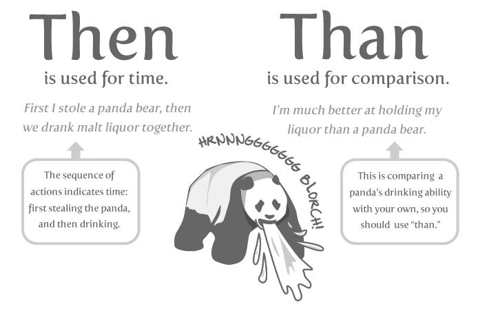

Spelling - Word Usage - Common Words and Phrases to Use and Avoid
~~~~~~~~~~~~~~~~~~~~~~~~~~~~~~~~~~~~~~~~~~~~~~~~~~~~~~~~~~~~~~~~~~

Acronyms
++++++++++++++++

Always uppercase. An acronym is a word formed from the initial letters of a name, such as ROM for Read-only memory,
SaaS for Software as a Service, or by combining initial letters or part of a series of words, such as LILO for LInux
LOader.

Spell out the acronym before using it in alone text, such as "The Embedded DevKit (EDK)..."

Applications
+++++++++++++++++++
When used as a proper name, use the capitalization of the product, such as GNUPro or Source-Navigator. When used as a command, use lowercase as appropriate, such as "To start GCC, type ``gcc``."

.. note::

    "vi" is always lowercase.

As
++++++++
This is often used to mean "because", but has other connotations, for example, parallel or simultaneous actions. If you mean "because", say "because".

Asks for
++++++++++++++++
Use "requests" instead.

Assure/Ensure/Insure
++++++++++++++++++++++++++++
Assure implies a sort of mental comfort. As in "I assured my husband that I would eventually bring home beer."

Ensure means "to make sure."

Insure relates to monetary insurance.

Back up
++++++++++++++
This is a verb. You "back up" files; you do not "backup" files.

Backup
++++++++++
This is a noun. You create "backup" files; you do not create "back up" files.

Backward
++++++++++++++
Correct. Avoid using backwards unless you are stating that something has "backwards compatibility."

Backwards compatibility
++++++++++++++++++++++++
Correct as is.

By way of
++++++++++++++++++
Use "using" instead.

Can/May
++++++++++++++
Use "can" to describe actions or conditions that are possible. Use "may" only to describe situations where permission is being given. If either "can," "could," or "may" apply, use "can" because it's less tentative.

CD or cd
+++++++++++++++
When referring to a compact disk, use CD, such as "Insert the CD into the CD-ROM drive." When referring to the change directory command, use cd. 

CD-ROM
+++++++++++++
Correct. Do not use "cdrom," "CD-Rom," "CDROM," "cd-rom" or any other variation. When referring to the drive, use CD-ROM drive, such as "Insert the CD into the CD-ROM drive." The plural is "CD-ROMs."

Command line
+++++++++++++++++++
Correct. Do not use "command-line" or "commandline." 

Use to describes where to place options for a command, but not where to type the command. Use "shell prompt" instead to describe where to type commands. The line on the display screen where a command is expected. Generally, the command line is the line that contains the most recently displayed command prompt.

Daylight saving time (DST)
+++++++++++++++++++++++++++++++

Correct. Do not use daylight savings time. Daylight Saving Time (DST) is often misspelled "Daylight Savings", with an "s" at the end. Other common variations are "Summer Time"and "Daylight-Saving Time". (https://www.timeanddate.com/time/dst/daylight-savings-time.html)

Download
++++++++++++++++
Correct. Do not use "down load" or "down-load."

e.g.
++++++++++
Spell it out: "For example."

Failover
+++++++++++++++
When used as a noun, a failover is a backup operation that automatically switches to a standby database, server or network if the primary system fails or is temporarily shut down for servicing. Failover is an important fault tolerance function of mission-critical systems that rely on constant accessibility. Failover automatically and transparently to the user redirects requests from the failed or down system to the backup system that mimics the operations of the primary system.

Fail over
++++++++++++
When used as a verb, fail over is two words since there can be different tenses such as failed over.

Fewer
+++++++++++++++++++
Fewer is used with plural nouns. Think things you could count.  Time, money, distance, and weight are often listed as exceptions to the traditional "can you count it" rule, often thought of a singular amounts (the work will take less than 5 hours, for example).

File name
+++++++++++++
Correct. Do not use "filename."

File system
+++++++++++++++++++
Correct. Do not use "filesystem." The system that an operating system or program uses to organize and keep track of files. For example, a hierarchical file system is one that uses directories to organize files into a tree structure. Although the operating system provides its own file management system, you can buy separate file management systems. These systems interact smoothly with the operating system but provide more features, such as improved backup procedures and stricter file protection.

For instance
++++++++++++++
For example," instead.

For further/additional/whatever information
++++++++++++++++++++++++++++++++++++++++++++++
Use "For more information"

For this reason
++++++++++++++++++
Use "therefore".

Forward
++++++++++++++
Correct. Avoid using "forwards."

Gigabyte (GB)
++++++++++++++
2 to the 30th power (1,073,741,824) bytes. One gigabyte is equal to 1,024 megabytes. Gigabyte is often abbreviated as G or GB.

Got
++++++++++++++
Avoid. Use "must" instead.

High-availability
++++++++++++++++++
Correct. Do not use "high availability."

Highly available
++++++++++++++++++
Correct. Do not use highly-available."

Hostname
+++++++++++++++++
Correct. Do not use host name.

i.e.
++++++++++++++
Spell it out: "That is."

Installer
++++++++++++++
Avoid. Use "installation program" instead.

It's and its
++++++++++++++
"It's" is a contraction for "it is;" use "it is" instead of "it's." Use "its" as a possessive pronoun (for example, "the store is known for its low prices").

Less
++++++++++++
Less is used with singular nouns. For example "View less details" wouldn't be correct but "View less detail" works. Use fewer when you have plural nouns (things you can count).

Linux
++++++++++++++
Correct. Do not use "LINUX" or "linux" unless referring to a command, such as "To start Linux, type linux." Linux is a registered trademark of Linus Torvalds.

Login
++++++++++++++
A noun used to refer to the login prompt, such as "At the login prompt, enter your username."

Log in
++++++++++++++
A verb used to refer to the act of logging in. Do not use "login," "loggin," "logon," and other variants. For example, "When starting your computer, you are requested to log in..."

Log on
++++++++++++++
To make a computer system or network recognize you so that you can begin a computer session. Most personal computers have no log-on procedure -- you just turn the machine on and begin working. For larger systems and networks, however, you usually need to enter a username and password before the computer system will allow you to execute programs.

Lots of
++++++++++++++
Use "Several" or something equivalent instead.

Make sure
++++++++++++++
This means "be careful to remember, attend to, or find out something." For example, "...make sure that the rhedk group is listed in the output."
Try to use verify or ensure instead.

Manual/man page
++++++++++++++++++
Correct. Two words. Do not use "manpage"

MB
++++++++
(1) When spelled MB, short for megabyte (1,000,000 or 1,048,576 bytes, depending on the context).
(2) When spelled Mb, short for megabit.

MBps
++++++++++++++
Short for megabytes per second, a measure of data transfer speed. Mass storage devices are generally measured in MBps.

MySQL
++++++++++++++
Common open source database server and client package. Do not use "MYSQL" or "mySQL."

Need to
++++++++++++++
Avoid. Use "must" instead.

Read-only
++++++++++++
Correct. Use when referring to the access permissions of files or directories.

Real time/real-time
++++++++++++++++++++++
Depends. If used as a noun, it is the actual time during which something takes place. For example, "The computer may partly analyze the data in real time (as it comes in) -- R. H. March." If used as an adjective, "real-time" is appropriate. For example, "XEmacs is a self-documenting, customizable, extensible, real-time display editor."

Refer to
++++++++++++++
Use to indicate a reference (within a manual or website) or a cross-reference (to another manual or documentation source).

See
++++++++++++++
Don't use. Use "Refer to" instead.

Since
++++++++
This is often used to mean "because", but "since" has connotations of time, so be careful. If you mean "because", say "because".

Tells
++++++++++++++
Use "Instructs" instead.

That/which
++++++++++++++
"That" introduces a restrictive clause-a clause that must be there for the sentence to make sense. A restrictive clause often defines the noun or phrase preceding it. "Which" introduces a non-restrictive, parenthetical clause-a clause that could be omitted without affecting the meaning of the sentence. For example: The car was travelling at a speed that would endanger lives. The car, which was traveling at a speed that would endanger lives, swerved onto the sidewalk. Use "who" or "whom," rather than "that" or "which," when referring to a person.

Then/than
++++++++++++++
 "Then" refers to a time in the past or the next step in a sequence. "Than" is used for comparisons.

Third-party
++++++++++++++ 
Correct. Do not use "third party".

Troubleshoot
++++++++++++++
Correct. Do not use "trouble shoot" or "trouble-shoot." To isolate the source of a problem and fix it. In the case of computer systems, the term troubleshoot is usually used when the problem is suspected to be hardware -related. If the problem is known to be in software, the term debug is more commonly used.

UK
++++++++++++++
Correct as is, no periods.

UNIX®
++++++++++++++
Correct. Do not use "Unix" or "unix." UNIX® is a registered trademark of The Open Group.

Unset
++++++++++++++
Don't use. Use Clear.

US
++++++++++++++
Correct as is, no periods.

User
++++++++++++++
When referring to the reader, use "you" instead of "user." For example, "The user must..." is incorrect. Use "You must..." instead. If referring to more than one user, calling the collection "users" is acceptable, such as "Other users may wish to access your database."

Username
++++++++++++++
Correct. Do not use "user name."

View
++++++++++++++
When using as a reference ("View the documentation available online."), do not use View. Use "Refer to" instead.

Within
++++++++++++++
Don't use to refer to a file that exists in a directory. Use "In".

World Wide Web
++++++++++++++
Correct. Capitalize each word. Abbreviate as "WWW" or "Web."

Webpage
++++++++++++++
Correct. Do not use "web page" or "Web page."

Web server
++++++++++++++
Correct. Do not use "webserver". For example, "The Apache HTTP Server is the default Web server..."
 
Website
++++++++++++++
Correct. Do not use "web site" or "Web site." For example, "The Ansible website contains ..."

Who/whom
++++++++++++++
Use the pronoun "who" as a subject. Use the pronoun "whom" as a direct object, an indirect object, or the object of a preposition. For example: Who owns this? To whom does this belong?

Will
++++++++++++++
Do not use future tense unless it is absolutely necessary. For instance, do not use the sentence, "The next section will describe the process in more detail." Instead, use the sentence, "The next section describes the process in more detail."

Wish
++++++++++++++
Use "need" instead of "desire" and "wish." Use "want" when the reader's actions are optional (that is, they may not "need" something but may still "want" something).

x86
++++++++++++++
Correct. Do not capitalize the "x."

x86_64
++++++++++++++
Do not use. Do not use "Hammer". Always use "AMD64 and Intel® EM64T" when referring to this architecture.

You
++++++++++++++
Correct. Do not use "I," "he," or "she."

You may
++++++++++++++
Try to avoid using this. For example, "you may" can be eliminated from this sentence "You may double-click on the desktop..."

