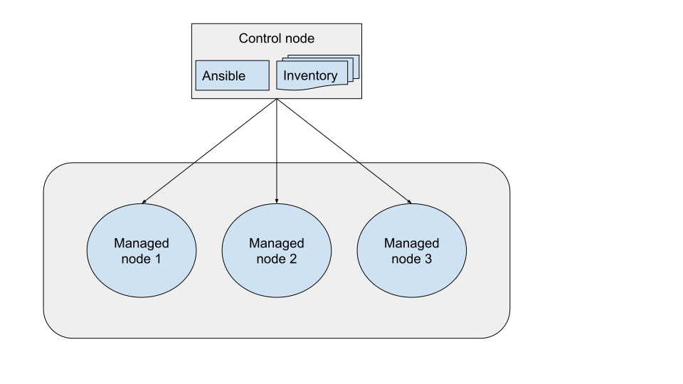

.. _getting_started_index:

############################
Getting started with Ansible
############################

Ansible automates the management of remote systems and controls their desired state.
A basic Ansible environment has three main components:

Control node
   A system on which Ansible is installed.
   You run Ansible commands such as ``ansible`` or ``ansible-inventory`` on a control node.

Managed node
   A remote system, or host, that Ansible controls.

Inventory
   A list of managed nodes that are logically organized.
   You create an inventory on the control node to describe host deployments to Ansible.

Ready to start using Ansible?
Complete the following steps to get up and running:

#. Install Ansible. Visit the :ref:`installation guide<installation_guide>` for complete details.
   
   .. code-block:: bash 
      
      python3 -m pip install --user ansible

#. Create an inventory by adding the IP address or fully qualified domain name (FQDN) of one or more remote systems to ``/etc/ansible/hosts``.
   The following example adds the IP addresses of three virtual machines in KVM:

   .. code-block:: ini

      [myvirtualmachines]
      192.0.2.50
      192.0.2.51
      192.0.2.52

#. Verify the hosts in your inventory.
   
   .. code-block:: bash 

      ansible all --list-hosts

   .. code-block:: ansible-output

      hosts (1):
        192.0.2.50
        192.0.2.51
        192.0.2.52

#. Set up SSH connections so Ansible can connect to the managed nodes.

   a. Add your public SSH key to the ``authorized_keys`` file on each remote system.
   b. Test the SSH connections, for example:

   .. code-block:: bash

      ssh username@192.0.2.50
    
   If the username on the control node is different on the host, you need to pass the ``-u`` option with the ``ansible`` command.

#. Ping the managed nodes.

   .. code-block:: bash 

      ansible all -m ping

   .. literalinclude:: ansible_output/ping_output.txt
      :language: text

Congratulations! You are now using Ansible.
Continue by :ref:`learning how to build an inventory<get_started_inventory>`.

.. seealso::

   `Ansible Demos <https://github.com/ansible/product-demos>`_
       Demonstrations of different Ansible usecases
   `Ansible Labs <https://www.ansible.com/products/ansible-training>`_
       Labs to provide further knowledge on different topics
   `Mailing List <https://groups.google.com/group/ansible-project>`_
       Questions? Help? Ideas?  Stop by the list on Google Groups
   :ref:`communication_irc`
       How to join Ansible chat channels

.. toctree::
   :maxdepth: 1

   get_started_inventory
   get_started_playbook
   basic_concepts