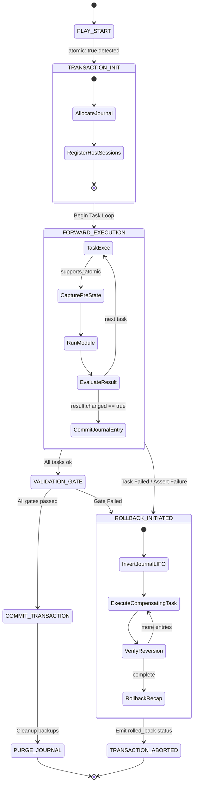

# AEP-0082: Ansible Transaction Mode (Atomic Playbooks with Automatic Rollback)

- **AEP Number**: 0082
- **Title**: Ansible Transaction Mode (`atomic` playbooks with automated compensation rollback)
- **Author**: Red Hat & Open Source Community Working Group
- **Status**: Draft / Proposed
- **Type**: Feature (Core Engine & Module Architecture)
- **Target Version**: `ansible-core` 2.19+
- **Created**: 2026-09-26
- **Discussion Issue**: `ansible/ansible#aep-0082`

---

## 1. Executive Summary

Ansible is fundamentally an imperative-declarative hybrid automation engine: while modules aim for idempotence, playbook execution is strictly sequential and non-transactional. When a task in a multi-task play fails halfway through execution, the managed host is left in a **partially mutated, inconsistent state** ("broken half-deploy"). Operators must either manually revert changes or craft cumbersome, fragile `block/rescue` routines that duplicate reverse logic.

This proposal introduces **Ansible Transaction Mode**: an opt-in, non-breaking core capability enabling atomic playbook execution across managed hosts. When `atomic: true` is set on a play, role, or block:
1. Every task execution records a structured, serialized **Compensation Journal Entry** on the controller/host.
2. If any subsequent task fails (or validation gates fail), the core engine halts forward execution and initiates an automated, reverse-order (LIFO) **Compensating Rollback Phase**.
3. Modules declare atomic support via an explicit contract (`supports_atomic=True`), returning reversible undo metadata or delegating filesystem/service snapshots to core compensation primitives.
4. Non-atomic modules in an atomic play raise clear static or runtime warnings, gracefully degrading according to user-defined policy (`rollback_policy: strict | best_effort`).

---

## 2. Motivation & Problem Statement

### 2.1 The "Partial Mutation" Dilemma
Consider a standard deployment play:
```yaml
- hosts: webservers
  tasks:
    - name: 1. Deploy new application configuration
      ansible.builtin.template:
        src: app.conf.j2
        dest: /etc/app/app.conf # Overwrites working v1 with v2

    - name: 2. Upgrade application binary
      ansible.builtin.apt:
        name: app-server=2.0.0
        state: present

    - name: 3. Apply schema migrations
      ansible.builtin.command:
        cmd: /opt/app/bin/migrate --up

    - name: 4. Restart service
      ansible.builtin.systemd_service:
        name: app-server
        state: restarted

    - name: 5. Synthetic health check
      ansible.builtin.uri:
        url: https://127.0.0.1:8443/healthz
        status_code: 200
```

If Task 5 (Health Check) fails because the configuration in Task 1 had a syntax error:
- The system is now running broken configuration.
- The service may be stopped or crashlooping.
- The binary is upgraded to v2.
- The playbook terminates with `FAILED`.

### 2.2 Why Existing Mechanisms Are Insufficient
| Mechanism | Why It Fails as an Atomic Engine |
| :--- | :--- |
| **`--check` Mode** | Only predicts changes; cannot predict execution-time failures (database timeouts, compilation errors, port conflicts, downstream service health). |
| **`backup: yes`** | Creates point-in-time timestamped files on remote disk (`/etc/app/app.conf.1234.2026-09-26@10:00:00~`), but provides no orchestrator-coordinated mechanism to discover, link, or restore them upon downstream failure. |
| **`block / rescue`** | Requires manual authoring of inverse logic. If a play has 20 tasks, the operator must write 20 inverse tasks in reverse order inside `rescue:`, leading to duplicated playbook code, maintenance drift, and manual errors. |
| **Handler mechanisms** | Handlers only run on change and forward notification; they cannot react dynamically to revert prior tasks when an unhandled exception or failed condition occurs in later tasks. |

### 2.3 The Architectural Opportunity
By standardizing a **Compensating Transaction Pattern (Saga Pattern)** inside `ansible-core`, Ansible achieves the safety guarantees expected of modern cloud platforms (Kubernetes rollouts, Git reverts, Database transactions) while retaining its agentless, Python-based simplicity.

---

## 3. High-Level Architecture & Lifecycle

### 3.1 Transaction State Machine



### 3.2 Key Components
1. **`PlayContext.atomic` (Flag & Policy)**:
   Propagates transaction configuration from play down through block and task levels.
2. **`AnsibleTransactionJournal`**:
   An in-memory and on-disk journal tracking every mutating state transition per host, storing reversible inverse payloads (file hashes, prior systemd states, previous package versions).
3. **`RollbackManager` (`lib/ansible/executor/rollback_manager.py`)**:
   Coordinates failure interception in `TaskExecutor` and executes compensating actions in reverse topological/chronological order.
4. **`Module Rollback Protocol` (`lib/ansible/module_utils/basic.py`)**:
   Enables modules to register inverse operations (`undo_action`) and restore points.

---

## 4. User-Facing Syntax & Playbook API

### 4.1 Play-Level Keyword
```yaml
- name: Deploy Production Core
  hosts: all
  atomic: true
  rollback_policy: strict # strict | best_effort
  journal_storage: memory # memory | persistent (/var/lib/ansible/journal)
  tasks:
    - name: Push config
      ansible.builtin.template:
        src: config.conf.j2
        dest: /etc/app/config.conf
```

### 4.2 Block-Level Granularity
Transactions can be scoped to specific critical regions:
```yaml
- name: Mixed Workflow
  hosts: database
  tasks:
    - name: Read-only precheck
      ansible.builtin.command: /usr/bin/check-cluster
      
    - name: Atomic Migration Block
      atomic: true
      block:
        - name: Update DB Schema
          postgresql_query:
            query: "ALTER TABLE users ADD COLUMN uuid UUID;"
        - name: Update Microservice Config
          ansible.builtin.copy:
            src: db.env
            dest: /opt/service/db.env
```

### 4.3 Checkpoints & Savepoints
Users can declare manual transaction boundaries or explicit savepoints:
```yaml
    - name: Savepoint Before Complex Operation
      ansible.builtin.checkpoint:
        name: sp_pre_migration

    # Tasks...

    - name: Emergency manual revert if conditional triggered
      ansible.builtin.rollback_to:
        checkpoint: sp_pre_migration
      when: cluster_degraded | default(false)
```

---

## 5. Module Rollback Contract & Implementation

### 5.1 The `supports_atomic` Protocol
Modules declare capability in their argument spec:
```python
class AnsibleModule:
    def __init__(self, argument_spec, supports_check_mode=False,
                 supports_atomic=True, ...):
        self.supports_atomic = supports_atomic
        self._undo_actions = []
```

### 5.2 Snapshot & Compensation Registration
During module execution, if a state change is made (`changed=True`), the module appends an `undo_action` payload to the result dictionary:

```python
# Inside ansible.builtin.copy module
if dest_exists:
    # Core automatic staging or module-provided backup
    backup_path = module.backup_local(dest)
    module.register_undo_action(
        module="ansible.builtin.copy",
        action="restore_backup",
        args={
            "src": backup_path,
            "dest": dest,
            "mode": original_stat.st_mode,
            "owner": original_stat.st_uid,
            "group": original_stat.st_gid
        }
    )
else:
    module.register_undo_action(
        module="ansible.builtin.file",
        action="delete",
        args={"path": dest}
    )
```

### 5.3 Core Module Reversibility Matrix (Phase 1 & 2)

| Module | Compensation Strategy | Failure Recovery Guarantee |
| :--- | :--- | :--- |
| `ansible.builtin.copy` | Snapshot original content & file attributes to temporary staging journal; restore on rollback. If file was newly created, unlink on rollback. | **Full (Deterministic)** |
| `ansible.builtin.template` | Same as `copy`. | **Full (Deterministic)** |
| `ansible.builtin.file` | Snapshot state (mode, ownership, symlink target). If directory created, rmdir (if empty) on rollback. | **Full (Deterministic)** |
| `ansible.builtin.lineinfile` | Store original file buffer hash or line position; replace/delete during compensation. | **Full (Deterministic)** |
| `ansible.builtin.systemd_service` | Capture `ActiveState`, `UnitFileState`. Restore previous run state (`started`, `stopped`) on rollback. | **High (System state dependent)** |
| `ansible.builtin.apt` / `dnf` | Capture previously installed package NEVRA / version. If install occurred, run purge/remove. If upgrade occurred, downgrade to previous version. | **Medium-High (Repo repository dependent)** |
| `ansible.builtin.command` / `shell` | User provides `undo_command` parameter or module is marked non-atomic. | **Explicit / User Defined** |

---

## 6. Executor & Engine Internals

### 6.1 `TaskExecutor` Workflow
In `lib/ansible/executor/task_executor.py`:
1. **Pre-Task**: Check if `play_context.atomic is True`.
2. **Post-Task**: When module returns `result`:
   - If `result['changed'] is True`: Extract `result['_ansible_undo']`.
   - Append to `play_context.journal[host.name]`.
   - If task has failed (`result['failed'] is True` or `res.is_failed()`):
     - Trigger `rollback_manager.initiate_rollback(host=host, journal=play_context.journal[host.name])`.

### 6.2 Rollback Manager Execution Loop
The rollback manager executes independently per host:
```python
def initiate_rollback(self, host, journal_entries):
    display.banner(f"ROLLBACK INITIATED [{host.name}]")
    for entry in reversed(journal_entries):
        display.v(f"Reverting task: {entry.task_name} via {entry.undo_module}")
        undo_task = self.synthesize_task(entry)
        res = self.executor.run_task(undo_task, host)
        if res.is_failed():
            display.error(f"Rollback compensation failed for {entry.task_name}")
            if self.policy == 'strict':
                raise AnsibleRollbackError(...)
    display.banner(f"ROLLBACK COMPLETED [{host.name}]")
```

---

## 7. Security, State Isolation & Edge Cases

### 7.1 Secret & Credential Redaction
All compensation payloads are subject to standard `no_log` filtering. Staged backup files are stored in cryptographically secure temporary directories (`mkdtemp(prefix='ansible_journal_')`) with `0700` POSIX permissions, owned by the target execution user (or root when escalated via `become`).

### 7.2 Host Failure & Partial Network Disconnect
If the network connection drops during a rollback phase:
- The persistent journal remains on the remote host in `/var/lib/ansible/journal/<play_uuid>.json`.
- A new CLI tool `ansible-journal recover --play-id <uuid>` can inspect and resume rollback out-of-band.

---

## 8. Rollout & Phased Delivery

1. **Phase 1 (`ansible-core` 2.19)**:
   - Core executor primitives: `PlayContext.atomic`, `RollbackManager`, `AnsibleTransactionJournal`.
   - Module compensation protocol in `ansible.module_utils.basic`.
   - Rollback support in core file modules: `copy`, `template`, `file`, `lineinfile`.
   - CLI flags: `--atomic`, `--rollback-policy=strict|best_effort`.

2. **Phase 2 (`ansible-core` 2.20)**:
   - System modules: `systemd_service`, `service`, package managers (`apt`, `dnf`, `yum`).
   - Checkpoints and savepoints (`checkpoint`, `rollback_to`).
   - Remote persistent journals and recovery CLI.

3. **Phase 3 (Collections & Ecosystem)**:
   - Cloud collections (`amazon.aws`, `azure.azcollection`, `google.cloud`) implement atomic compensation for provisioned resources (VMs, security groups, route tables).
   - Kubernetes collection (`kubernetes.core`) hooks into rollout undo.

---

## 9. Backward Compatibility & Impact Assessment

- **Zero Breaking Changes**: Playbooks without `atomic: true` behave 100% identically to current Ansible releases.
- **Opt-in Module Interface**: Existing modules continue functioning; unannotated modules default to `supports_atomic=False` and log warnings under atomic plays.
- **Minimal Performance Overhead**: When enabled, the journal overhead is negligible (JSON metadata generation < 1.5ms per task; disk backup uses hardlinks when on same filesystem).
